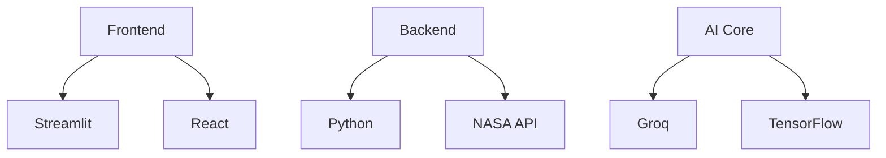

<div align="center">

# 🚀 Journey to Mars: The Ultimate Red Planet Experience

[](https://mars-explorer.streamlit.app)
[](https://github.com/Humam-hub/Mars/stargazers)
[](https://choosealicense.com/licenses/mit/)
[](https://github.com/Humam-hub/Mars)

> *"Space is for everybody. It's not just for a few people in science or math, or for a select group of astronauts. That's our new frontier out there, and it's everybody's business."* - Christa McAuliffe


</div>

## 🌌 Welcome to the Future of Mars Exploration

Experience Mars like never before with our groundbreaking platform that brings the Red Planet right to your fingertips. Whether you're a space enthusiast, researcher, or dreamer, our suite of tools will transport you millions of miles away - all from the comfort of your device.

### 🎯 Why Choose Our Platform?

- **Real-Time Mars Data**: Direct feed from NASA's active Mars missions
- **AI-Powered Insights**: Advanced analysis of Martian phenomena
- **Interactive Experience**: Engage with Mars in ways previously impossible
- **Universal Access**: Available on any device, anywhere on Earth
- **Educational Focus**: Perfect for students, educators, and lifelong learners

## 🛸 Core Mission Features

<table>
<tr>
<td width="50%">

<h3 align="center">🤖 AI Mars Expert</h3>
<p align="center">Our state-of-the-art AI analyzes Martian data in real-time, providing unprecedented insights into the Red Planet's mysteries.</p>
</td>
<td width="50%">

<h3 align="center">📊 Live Mars Dashboard</h3>
<p align="center">Monitor real-time conditions on Mars, from weather patterns to geological activities, with our comprehensive dashboard.</p>
</td>
</tr>
</table>

## 🎮 Interactive Features

| Feature | Description | Status |
|---------|-------------|--------|
| 🧠 **Neural Mars AI** | Advanced AI system trained on decades of Mars research | ✅ Live |
| 🛰️ **Satellite Feed** | Real-time imagery from Mars-orbiting satellites | ✅ Live |
| 🌡️ **Weather Station** | Current Martian atmospheric conditions | ✅ Live |
| 🚗 **Rover Control** | Virtual rover navigation experience | 🔄 Beta |
| 🎓 **Mars Academy** | Interactive learning modules about Mars | ✅ Live |
| 🔬 **Science Lab** | Analyze Martian soil and atmospheric samples | 🔄 Beta |

## 👨‍🚀 Meet the Pioneers

Our team of dedicated experts is pushing the boundaries of Mars exploration technology:

<table>
<tr>
<td align="center">

<br />
<b>Muhammad Ibrahim Qasmi</b>
<br />
Mission Commander
<br />
<a href="https://github.com/muhammadibrahim313"></a>
<a href="https://www.linkedin.com/in/muhammad-ibrahim-qasmi-9876a1297/"></a>
</td>
<!-- [Similar blocks for other team members] -->
</tr>
</table>

## 🛠️ Technology Stack



## 🚀 Quick Launch Guide

```bash
# Clone the mission
git clone https://github.com/Humam-hub/Mars.git

# Prepare for launch
cd Mars
python -m venv venv
source venv/bin/activate  # Windows: venv\Scripts\activate

# Install mission systems
pip install -r requirements.txt

# Initiate launch sequence
streamlit run app.py
```

## 🌍 Community & Support

- 📚 [Documentation](https://mars-docs.streamlit.app)
- 💬 [Discord Community](https://discord.gg/mars-explorers)
- 🐛 [Issue Tracker](https://github.com/Humam-hub/Mars/issues)
- 📧 [Contact Us](mailto:mars@example.com)

## 🌟 Star History

[](https://star-history.com/#Humam-hub/Mars&Date)

<div align="center">

### 🌎 Join the Mission to Mars 🔴

<sub>Every star ⭐ helps us get closer to Mars. If you enjoy this project, please consider giving it a star!</sub>

---

<sub>© 2025 Mars Explorer Team | Licensed under MIT</sub>

</div>
